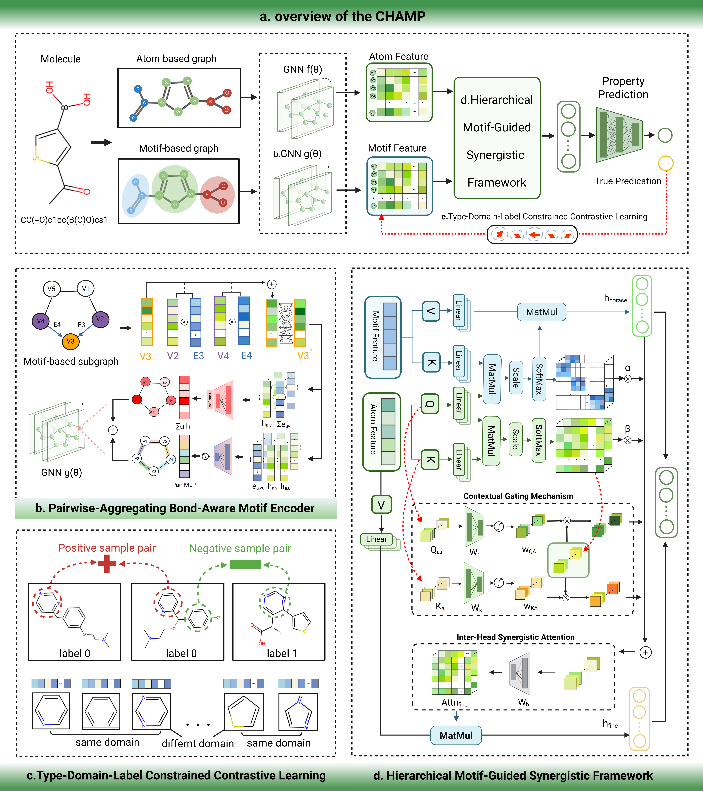

# CHAMP: A Coupled Hierarchical Atom-Motif Predictor

This repository provides the official PyTorch implementation for **CHAMP (Coupled Hierarchical Atom-Motif Predictor)**, a novel hierarchical Graph Neural Network framework designed to achieve state-of-the-art performance in molecular property prediction.

## Introduction

CHAMP is engineered to address two central challenges in GNN-based molecular science: achieving **Structural Completeness** in motif representations and ensuring **Functional Discriminability** through context-aware learning. It systematically overcomes the limitations of conventional models by introducing a dynamic **"guidance-fusion-regulation"** process that enables true **Synergistic Multi-scale Integration**.

By operating on a dual-view representation of molecules (atom-level and motif-level graphs), CHAMP learns to generate molecular representations that are not only structurally faithful but also highly sensitive to functional context, leading to superior predictive accuracy and enhanced chemical interpretability.

## Overall Architecture

The workflow of CHAMP unfolds in a three-stage hierarchical process designed to synergistically integrate fine-grained atomic details with coarse-grained functional semantics.



1.  **Dual-view Graph Encoding for Structural Completeness:** An input molecule is decomposed into two parallel graphical representations: a standard atom-level graph and a coarse-grained motif-level graph. The motif graph is processed by our innovative **(b) Pairwise-Aggregating Bond-Aware Motif Encoder (PABME)**, which generates structurally complete motif representations by explicitly modeling their internal topology.

2.  **Function-aware Refinement for Discriminability:** The initial motif embeddings, while structurally sound, are refined to be function-aware. Our **(c) Type-Domain-Label Constrained Contrastive Learning (TDL-CCL)** module sculpts the embedding space using property-label supervision. It trains the model to distinguish between motifs that are structurally homologous yet functionally divergent, imbueing the representations with high discriminative power.

3.  **Hierarchical Fusion and Molecular Prediction:** Finally, the **(d) Hierarchical Motif-Guided Synergistic Attention Framework (HMSAF)** performs dynamic cross-scale fusion. It leverages high-level motif semantics to provide top-down guidance to atomic attention. Through a symbiotic process involving contextual gating and inter-head synergy, it proactively resolves informational conflicts, ensuring features are mutually refined. The resulting unified molecular fingerprint is fed into an MLP for end-to-end property prediction.

## Core Innovative Components

### 1. PABME: Pairwise-Aggregating Bond-Aware Motif Encoder

*   **Problem:** Conventional models often treat motifs as a "bag-of-atoms," neglecting the critical semantics encoded in internal topology and chemical bonds.
*   **Innovation:** PABME explicitly models **atom-bond-atom** interactions. It employs a **dual-attention aggregation strategy** to capture both the importance of individual atoms and the relationships between atom pairs.
*   **Outcome:** Yields motif embeddings that faithfully preserve internal structural fidelity, achieving **Structural Completeness**.

### 2. TDL-CCL: Type-Domain-Label Constrained Contrastive Learning

*   **Problem:** The label-agnostic nature of conventional contrastive learning fails to differentiate between structurally similar motifs with distinct chemical functions.
*   **Innovation:** TDL-CCL introduces a novel **(Type, Domain, Label)** triplet constraint for sampling. It compels the model to discern the subtle structural variations that drive functional outcomes by contrasting structurally homologous but functionally divergent motifs.
*   **Outcome:** Sculpts an embedding space governed by **chemical function** rather than superficial topology, achieving **Functional Discriminability**.

### 3. HMSAF: Hierarchical Motif-Guided Synergistic Attention Framework

*   **Problem:** Naive fusion mechanisms (e.g., concatenation or pooling) lead to informational conflicts and redundancy between atomic and motif-level features.
*   **Innovation:** HMSAF implements a dynamic **"guidance-fusion-regulation"** process:
    *   **Guidance:** Top-down semantic signals from motifs steer atomic-level attention.
    *   **Fusion & Regulation:** A symbiotic fusion process featuring **Contextual Gating** and **Inter-Head Synergistic Attention** proactively modulates signals and forces cross-scale alignment.
*   **Outcome:** Achieves true **Cross-scale Synergy**, where features from different granularities are not merely combined but are mutually refined into a functionally coherent representation.

## Project Structure

```
CHAMP/
├── Model/              # Model definitions (PABME, TDL-CCL, HMSAF, etc.)
├── motif_extract/      # Motif extraction and graph construction modules
├── Experiment/         # Experimental results and visualization outputs
├── dataset/            # Dataset files
├── best_model/         # Directory for saving best-performing models
├── *.py                # Main execution scripts
├── requirements.txt    # List of dependencies
└── Args.py             # Configuration for command-line arguments
```

## Key Advantages

1.  **State-of-the-Art Performance:** Achieves leading results on 10 out of 11 challenging MoleculeNet benchmarks, demonstrating superior accuracy and generalizability.
2.  **Chemical Interpretability:** The hierarchical, motif-centric design ensures that the model's decision-making process aligns closely with established chemical principles.
3.  **Synergistic Multi-scale Modeling:** Moves beyond simple feature fusion to achieve true synergistic enhancement between atom- and motif-level information.
4.  **Robustness and Flexibility:** The modular architecture supports both regression and classification tasks and can be readily extended to new applications in drug discovery and materials science.

---

## Installation

```bash
pip install -r requirements.txt
```

**Main dependencies:**

- PyTorch (1.12.0+cu113)
- PyTorch Geometric (2.6.1)
- RDKit (2024.9.3)
- scikit-learn (1.7.2)
- UMAP-learn (0.5.7)

## Usage

### Parameter Configuration

Training parameters can be configured via `Args.py`:

- `--task`: Task type ('regression' or 'classification').
- `--dataset`: Name of the dataset (e.g., 'ESOL', 'FreeSolv', 'MUTAG').
- `--use_head_interaction`: Enable Inter-Head Synergistic Attention (HMSAF component).
- `--use_gating`: Enable the Contextual Gating Mechanism (HMSAF component).
- `--alpha/--beta`: Set the contrastive learning loss ratio (TDL-CCL component).

### Running Experiments

```bash
python main_classification.py --dataset BACE --use_head_interaction True --use_gating True
```

## Supported Datasets

The framework supports a wide range of datasets from MoleculeNet, including:

- **Regression Tasks:** ESOL, FreeSolv, Lipophilicity.
- **Classification Tasks:** MUTAG, HIV, BACE, Tox21.

Datasets are expected in a standard graph format, containing node features, edge connectivity, and molecular labels.